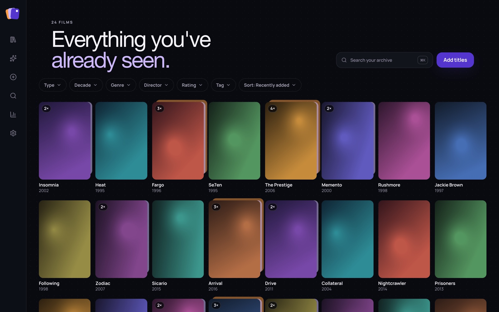
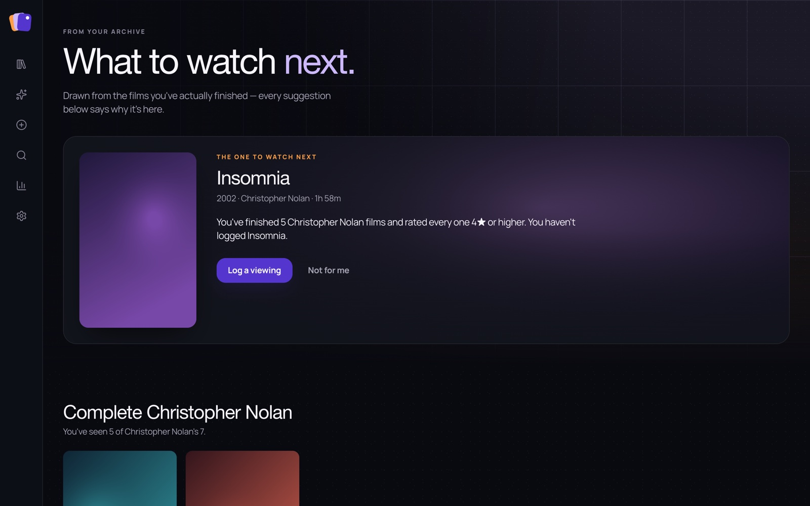
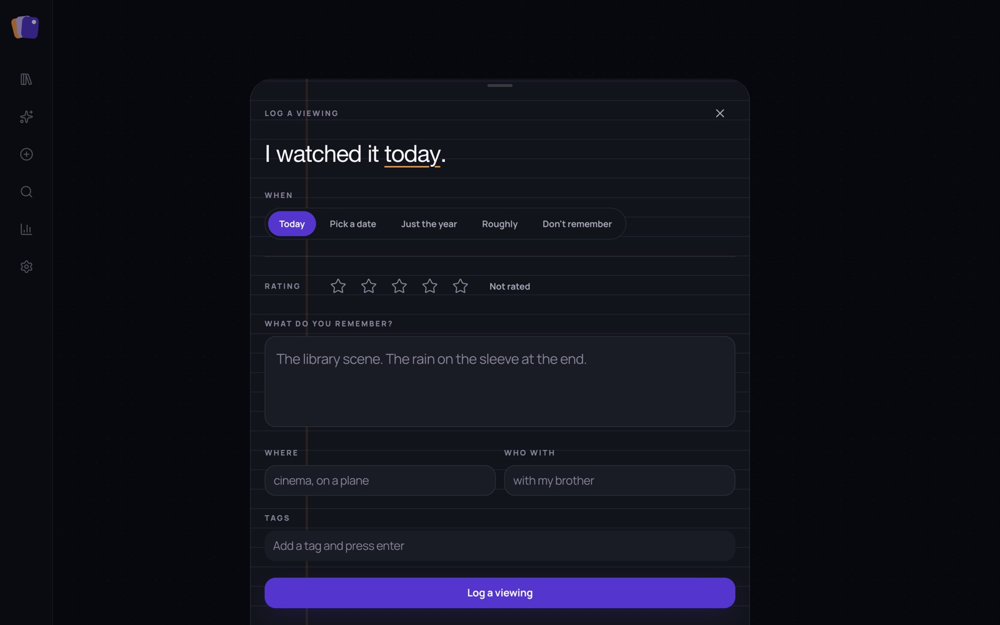
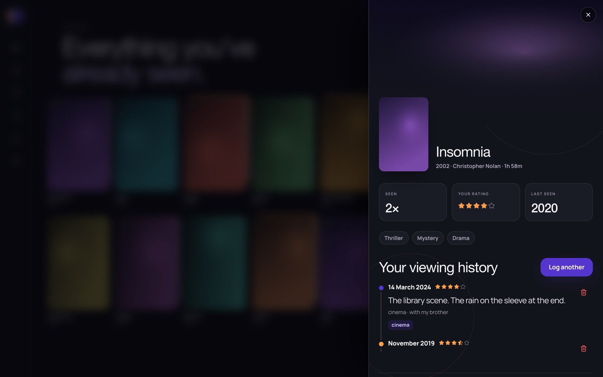
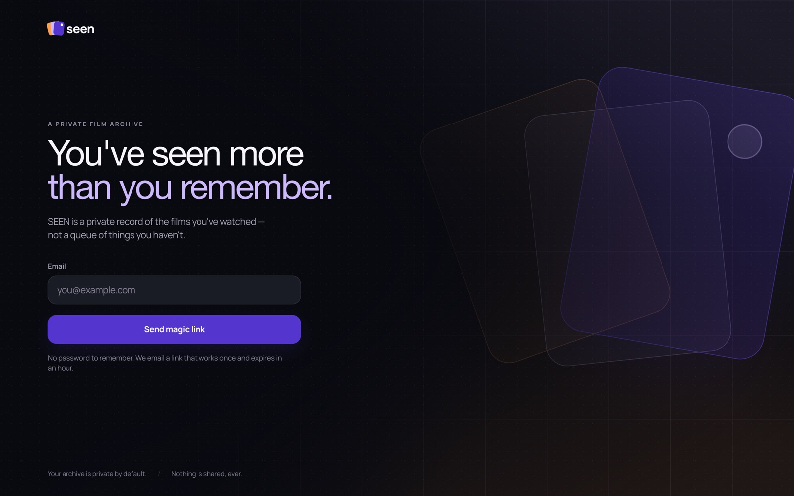
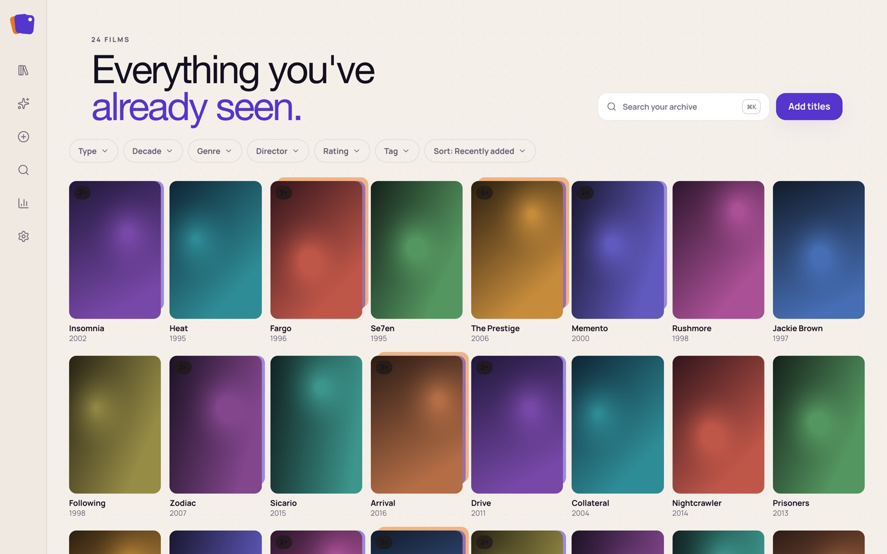
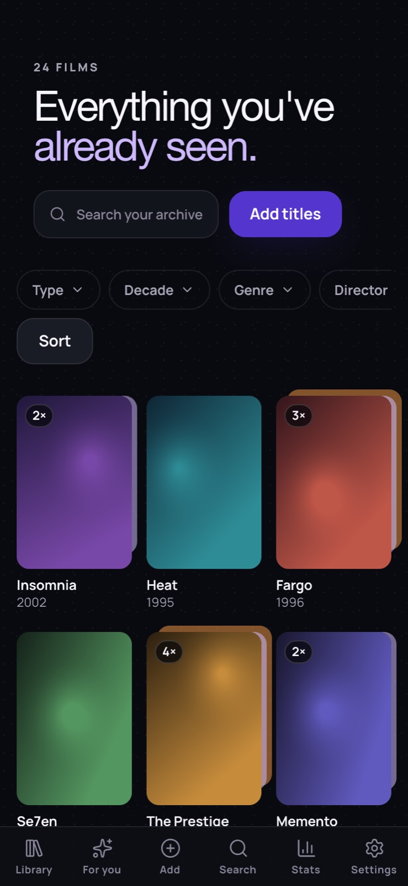
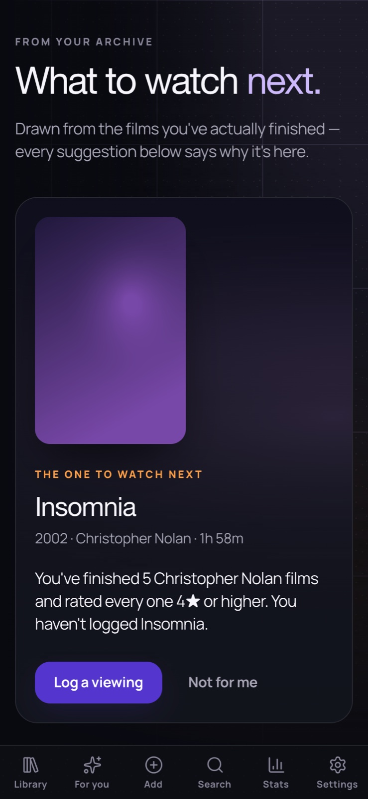

<div align="center">

# SEEN

**A private record of the films you've watched — not a queue of things you haven't.**

Every other film app is a list of things to get to. SEEN is the opposite:
a diary of what you've already lived through on screen, and what you
remember about it.

</div>

<div align="center">



</div>

---

## What it does

**Log a viewing the way you actually remember it.** Not everything
happened on a date you can name. A viewing can be logged as *today*, a
specific date, *just the year*, *roughly* ("as a kid", "one summer"), or
*don't remember* — each stored with its own precision rather than being
forced into a timestamp that pretends to be exact. Alongside it: a star
rating, what you remember, where you were, and who you were with.

**A library that's a record, not a backlog.** Filter by type, decade,
genre, director, rating or tag; sort; search. Rewatches stack visibly —
a title seen four times shows it. Everything lives in the URL, so any
view is a link.

**Recommendations that show their working.** Every suggestion on the
homepage carries a one-line reason that's auditable against your own
archive: *"You've finished 5 Christopher Nolan films and rated every one
4★ or higher. You haven't logged Insomnia."* Sections are built from
director completism, thin decades, and TMDB similarity to titles you
rated highly. **If the sentence can't be written, the shelf doesn't
ship** — there is no unexplained row on the page and no generic "you
might like" anywhere in the engine.

**Add by browsing, not by searching.** A poster wall you scroll year by
year and tap to log, for the times you're reconstructing years of viewing
at once rather than recording one film.

**Bring your history with you.** Letterboxd and IMDb CSV import with a
review step before anything is written; JSON and CSV export of
everything, any time.

---

## Screens

### The homepage — one film, argued properly

Rather than opening with a carousel, the page makes a single case: poster,
year, director, runtime, and the reason it's there. Shelves follow, each
with its own heading and because-line.



### The diary

The feature the rest of the product is built around. *When* is a
question with five honest answers, not a date picker that demands
precision you don't have.



### A title, and everything you remember about it

Opened from the grid as a slide-over — poster, backdrop, how many times
you've seen it, your rating, genres, and the full viewing history as a
timeline with your notes on it.



### Sign in

Magic-link only. No password to remember, because there is no password.



### Light and dark

Both are first-class and every colour is a token. Light mode isn't a
filter over dark — surfaces, patterns and even scrollbar alphas are
tuned separately, because equal alpha doesn't buy equal contrast in both
directions.

<div align="center">



</div>

### Mobile

<div align="center">


</div>

> **Note on these screenshots.** The poster artwork is generated
> placeholder art, not real cover images — the repo doesn't ship licensed
> stills. Everything else is the real app, captured from a production
> build.

---

## Stack

| | |
|---|---|
| **Framework** | Next.js 15, App Router, React 19 — server components by default |
| **Database** | Supabase (Postgres) with row-level security on every user-owned table |
| **Auth** | Supabase magic link |
| **Styling** | Tailwind CSS v4, all design tokens as CSS custom properties |
| **Data** | TanStack Query, TanStack Virtual for the library grid |
| **Motion** | Framer Motion, with a real `prefers-reduced-motion` path |
| **Metadata** | TMDB, cached in Postgres and refreshed by cron |

## Design notes

A few decisions that aren't obvious from the outside:

- **Every colour is measured, not eyeballed.** Contrast ratios are
  computed against the surface a token actually lands on. `--accent` is
  2.63:1 on the near-black ground, so it is never used for small text or
  as a focus ring — `--accent-text` (11.12:1) is. The reasoning is in
  the comments in [`app/globals.css`](app/globals.css).
- **Patterns, not flat backgrounds.** Each screen carries a low-contrast
  pattern from a shared library — a contact sheet under the library, a
  projector veil on discovery surfaces, archival paper under settings —
  held at 5–15% so posters stay the brightest thing on screen. They
  switch off entirely under `prefers-contrast: more`.
- **TMDB is a cache, not a dependency at read time.** Film metadata is
  upserted into Postgres and served from there; TMDB is only reached on a
  miss, and stale rows refresh in the background after the response has
  already been sent.
- **The scrollbar is part of the design system.** It resolves through the
  same tokens as everything else, with the Firefox and Chromium
  implementations deliberately fenced apart — see the comment in
  `globals.css` for why declaring both costs Chromium every hover and
  active state.

---

## Running it

**Prerequisites:** Node 22+ (see `engines` in `package.json`), a Supabase
project, a TMDB API read token.

```bash
git clone https://github.com/abouguri/seen.git
cd seen
npm install
```

Copy the environment template and fill it in:

```bash
cp .env.local.example .env.local
```

| Variable | Where it comes from |
|---|---|
| `NEXT_PUBLIC_SUPABASE_URL` | Supabase → Project Settings → API |
| `NEXT_PUBLIC_SUPABASE_ANON_KEY` | Same page |
| `SUPABASE_SERVICE_ROLE_KEY` | Same page — server-only, never exposed to the client |
| `TMDB_ACCESS_TOKEN` | TMDB → Settings → API → API Read Access Token (v4) |

Apply the schema:

```bash
supabase link --project-ref <your-project-ref>
supabase db push
```

Then:

```bash
npm run dev
```

### Scripts

| Command | |
|---|---|
| `npm run dev` | Development server |
| `npm run build` | Production build |
| `npm run start` | Serve the production build |
| `npm run lint` | ESLint |
| `npm run test:recommendations` | Drives the real recommendation engine against stubbed TMDB responses. The fixtures are hostile on purpose — every source returns films already logged and films already dismissed — so dedupe is tested rather than asserted |

### Deployment

Built for Vercel. [`vercel.json`](vercel.json) declares two nightly cron
jobs that backfill full metadata for films and shows added by poster
wall, where only a summary was cached at the time.

---

## Layout

```
app/
  (app)/            signed-in shell — nav rail, bottom tabs, pattern backdrop
    page.tsx        the homepage (recommendations)
    library/        the grid
    add/            the poster wall
    search/         "have you seen it?"
    stats/          charts
    film/[tmdbId]/  a title, by URL
  (auth)/sign-in/   magic link
  api/              route handlers
  not-found.tsx     branded 404
  error.tsx         recoverable error boundary
  global-error.tsx  self-contained root fallback

components/
  home/             lead recommendation, shelves, cards
  library/          grid, tiles, filters, detail panel
  film/  show/      viewing history, the log-viewing sheet
  wall/             poster wall
  shell/            nav rail, bottom tabs, the mark
  ui/               buttons, sheets, panels, stars, tags

lib/
  recommendations/  the engine, and its tests
  tmdb/             client, cache, enrichment
  stats/            aggregation
  supabase/         browser, server and middleware clients
  copy.ts           every user-facing string

supabase/migrations/
```

All user-facing text lives in [`lib/copy.ts`](lib/copy.ts) — nothing is
hardcoded in a component.

---

## Status

Working and deployed. See [ROADMAP.md](ROADMAP.md) for what's next — the
largest gap is season and episode tracking for TV, which is currently
logged at show level.
